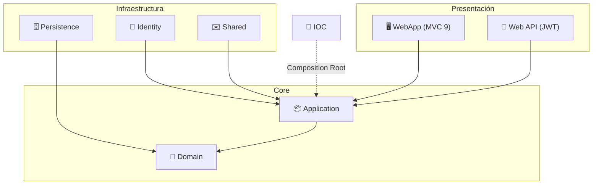
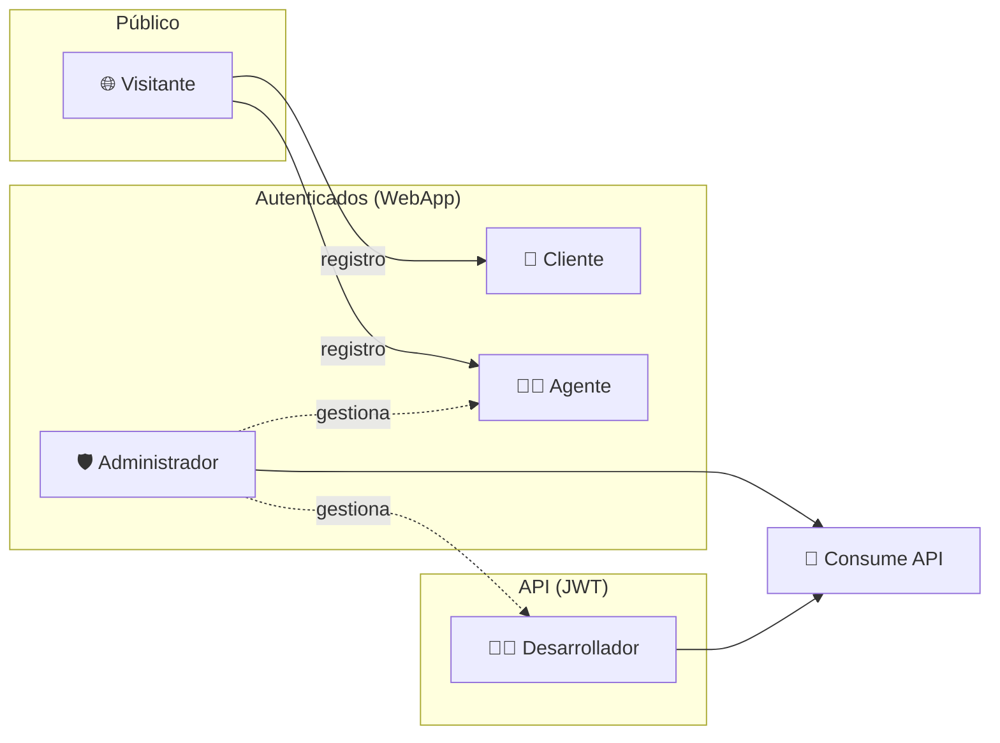

<div align="center">

# 🏡 RealEstateApp

### Plataforma integral de gestión inmobiliaria

*Portal público · Paneles por rol · Web API REST protegida con JWT*

<br/>


</div>

---

## 📖 Sobre el proyecto

**RealEstateApp** es una aplicación web para la **gestión integral de propiedades inmobiliarias** construida con **ASP.NET Core 9** aplicando **Onion Architecture** al 100%. Permite:

- 🌐 Consultar, filtrar y buscar propiedades **sin necesidad de iniciar sesión**.
- 👤 Que los **clientes** marquen favoritos, chateen con agentes y realicen **ofertas**.
- 🧑‍💼 Que los **agentes** gestionen sus propiedades, respondan mensajes y acepten/rechacen ofertas.
- 🛡️ Que los **administradores** gestionen usuarios, agentes, desarrolladores y catálogos.
- 🔌 Exponer una **Web API protegida con JWT** para administradores y desarrolladores.

> 🎯 **Objetivo:** administrar de manera integral el registro, consulta, publicación y seguimiento de propiedades para venta o alquiler, garantizando control de acceso, seguridad de datos y separación de responsabilidades entre la WebApp y los servicios expuestos.

---

## 🧩 El problema que resuelve

| Necesidad | Solución en RealEstateApp |
|-----------|---------------------------|
| 🔎 Un visitante quiere explorar propiedades sin registrarse | Portal público con listado, filtros combinables y búsqueda por código |
| 💬 Un cliente quiere negociar con un agente | Chat integrado + sistema de ofertas con estados |
| 🧑‍💼 Un agente necesita administrar su inventario | Mantenimiento CRUD con código único, imágenes y control de estado |
| 🛡️ Un administrador debe controlar usuarios y catálogos | Panel con dashboard, gestión de usuarios y mantenimientos con borrado en cascada |
| 🔌 Un sistema externo necesita consumir datos de forma segura | Web API REST versionada, protegida con JWT y documentada con Swagger |
| 🔐 Control de acceso estricto | ASP.NET Identity + roles + filtros de autorización en navegación y URL directa |

---

## ✨ Características principales

<table>
<tr>
<td width="50%">

**🌐 Portal público**
- Listado de propiedades disponibles
- Búsqueda por código (6 dígitos)
- Filtros combinables (tipo, precio, hab., baños)
- Detalle con galería e info del agente
- Directorio público de agentes activos

</td>
<td width="50%">

**👤 Cliente**
- Home con favoritos
- "Mis propiedades" favoritas
- Chat con el agente responsable
- Ofertas con estados (Pendiente/Aceptada/Rechazada)

</td>
</tr>
<tr>
<td width="50%">

**🧑‍💼 Agente**
- Home con propiedades disponibles y vendidas
- Mantenimiento CRUD de propiedades
- Gestión de conversaciones y ofertas
- Aceptar oferta → marca vendida (atómico)
- Perfil editable

</td>
<td width="50%">

**🛡️ Administrador + 🔌 API**
- Dashboard con indicadores
- Gestión de agentes, admins y desarrolladores
- Catálogos (tipos, ventas, mejoras)
- Web API REST con JWT + Swagger
- Seeds de roles y usuarios

</td>
</tr>
</table>

---

## 🏛️ Arquitectura en un vistazo



**8 proyectos** · **Onion Architecture** · **Repositorios y servicios genéricos** · **AutoMapper** · **`ValidationResult<T>`** para el flujo de negocio sin excepciones.

👉 Detalle completo en **[Arquitectura](docs/01-arquitectura.md)**.

---

## 🚀 Inicio rápido

```bash
# 1. Clonar
git clone https://github.com/JoelAlBenitez/RealEstateApp.git
cd RealEstateApp

# 2. Configurar cadena de conexión, EmailSettings y JwtSettings (user-secrets)

# 3. Aplicar migraciones (contextos de negocio e Identity)
dotnet ef database update --project Source/Infraestructure/RealEstateApp.Infraestructure.Persistence --startup-project Source/Presentation/RealEstateApp.Presentation.WebApp
dotnet ef database update --project Source/Infraestructure/RealEstateApp.Infraestructure.Identity   --startup-project Source/Presentation/RealEstateApp.Presentation.WebApp

# 4a. Ejecutar la WebApp
cd Source/Presentation/RealEstateApp.Presentation.WebApp && dotnet run

# 4b. Ejecutar la Web API (Swagger en /swagger)
cd Source/Presentation/RealEstateApp.Presentation.Api && dotnet run
```

👉 Guía detallada en **[Instalación y Ejecución](docs/02-instalacion-y-ejecucion.md)**.

---

## 🧰 Stack tecnológico

| Categoría | Tecnología |
|-----------|-----------|
| Framework | ASP.NET Core 9 (MVC + Web API) |
| Persistencia | Entity Framework Core 9 (Code First) + SQL Server |
| Identidad | ASP.NET Core Identity |
| API | JWT Bearer · Asp.Versioning · Swagger (Swashbuckle) |
| Mapeo | AutoMapper 16 |
| Correos | MailKit + MimeKit |
| UI | Bootstrap 5 · jQuery · CSS modular |
| Arquitectura | Onion Architecture · Repository · Service Layer · DTO/ViewModel |

---

## 📚 Documentación (Índice)

Toda la documentación técnica y funcional vive en la carpeta [`docs/`](docs/), conectada entre sí:

| # | Documento | Contenido | Responsable |
|---|-----------|-----------|-------------|
| 🧅 | **[01 · Arquitectura](docs/01-arquitectura.md)** | Onion Architecture, capas, patrones, flujo de petición, DI | Equipo |
| ⚙️ | **[02 · Instalación y Ejecución](docs/02-instalacion-y-ejecucion.md)** | Requisitos, configuración, migraciones, seeds, troubleshooting | Equipo |
| 🗄️ | **[03 · Modelo de Datos](docs/03-modelo-de-datos.md)** | Entidades, relaciones (ERD), enums, ciclos de estado, cascada | Equipo |
| 🌐 | **[04 · Funcionalidades Generales](docs/04-funcionalidades-generales.md)** | Home público, agentes, registro, login | 👑 Joel |
| 👤 | **[05 · Módulo Cliente](docs/05-modulo-cliente.md)** | Favoritos, chat, ofertas | 🧑‍💼 Sebastián |
| 🧑‍💼 | **[06 · Módulo Agente](docs/06-modulo-agente.md)** | Mantenimiento, ofertas recibidas, perfil | 🧑‍💼 Sebastián |
| 🛡️ | **[07 · Módulo Administrador](docs/07-modulo-administrador.md)** | Dashboard, usuarios, catálogos | 🛡️ Adrián |
| 🔌 | **[08 · Web API REST](docs/08-api-rest.md)** | Endpoints, JWT, códigos HTTP, ejemplos | 👑 Joel |
| 🔐 | **[09 · Seguridad](docs/09-seguridad.md)** | Identity, autorización por rol, seeds | 👑 Joel |
| 👥 | **[10 · Equipo y Decisiones](docs/10-equipo-y-decisiones.md)** | Responsabilidades, decisiones, convenciones, QA | Equipo |

> 📄 Documentos funcionales originales (PDF): [Documento Funcional](docs/Mini%20proyecto%20final%20-%20RealEstateApp.pdf) · [Rúbrica WebApp](docs/Evaluacion%20Mini%20proyecto%20final%20-%20RealEstateApp%20(WebApp).pdf) · [Rúbrica WebApi](docs/Evaluacion%20Mini%20proyecto%20final%20-%20RealEstateApp%20(WebApi).pdf)

---

## 👥 Equipo de desarrollo

| Avatar | Desarrollador | Rol | Módulos |
|:------:|---------------|-----|---------|
| 👑 | **[Joel Benítez](https://github.com/JoelAlBenitez)** | **Líder técnico** · Code review · Reglas de negocio · Wireframes/UI-UX | Portal público, Login, Identity/Usuarios, **Web API**, Seguridad |
| 🛡️ | **[Adrián Brito](https://github.com/Adrixn23)** | Backend / Fullstack | Módulo **Administrador**, mantenimientos y catálogos |
| 🧑‍💼 | **[Sebastián Peguero](https://github.com/SebasPeguero)** | Backend / Fullstack | Módulos **Agente** y **Cliente** |

👉 Reparto detallado y decisiones en **[Equipo y Decisiones](docs/10-equipo-y-decisiones.md)**.

---

## 🔐 Roles del sistema



| Rol | WebApp | API |
|-----|:------:|:---:|
| 👤 Cliente | ✅ | ⛔ |
| 🧑‍💼 Agente | ✅ | ⛔ |
| 🛡️ Administrador | ✅ | ✅ |
| 🧑‍💻 Desarrollador | ⛔ | ✅ |

---

## 📁 Estructura del repositorio

```
RealEstateApp/
├── 📄 README.md                ← este archivo (índice general)
├── 📁 docs/                     ← documentación técnica y funcional (MD + PDF)
├── 📄 RealEstateApp.sln
└── 📁 Source/
    ├── 📁 Core/                 → Domain · Application
    ├── 📁 Infraestructure/      → Persistence · Identity · Shared
    ├── 📁 Presentation/         → WebApp (MVC) · Api (REST)
    └── 📁 RealStateApp.IOC/     → Composition Root
```

---

<div align="center">

**RealEstateApp** — Desarrollado por [Joel Benítez](https://github.com/JoelAlBenitez), [Adrián Brito](https://github.com/Adrixn23) y [Sebastián Peguero](https://github.com/SebasPeguero)

🧅 *Onion Architecture* · 🔐 *Secure by design* · 🇩🇴 *Precios en DOP*

</div>
