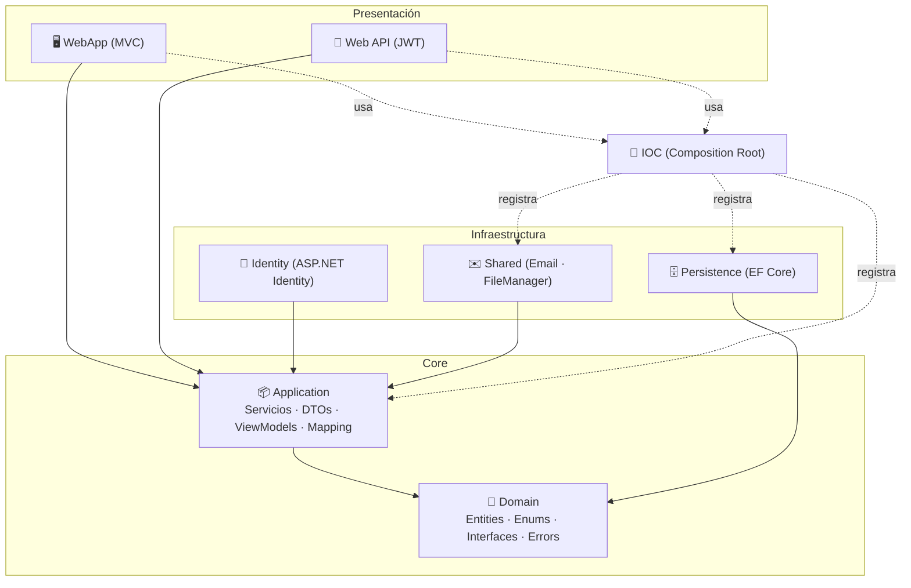
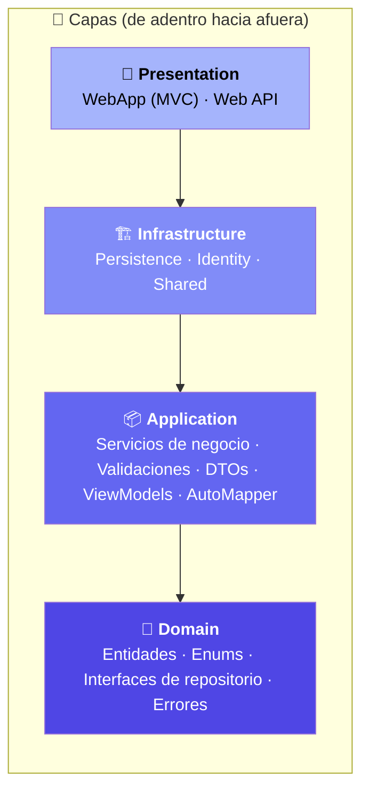
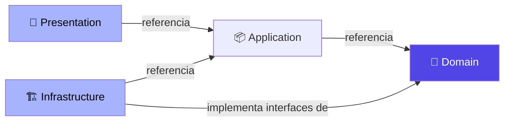
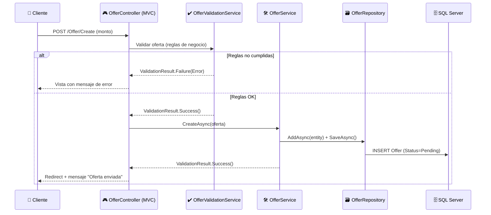

# 🧅 Arquitectura del Sistema — RealEstateApp

> Documento técnico de arquitectura. Describe la aplicación de **Onion Architecture**, las capas, dependencias, patrones de diseño y decisiones estructurales del proyecto.
>
> 📎 Volver al [README principal](../README.md) · Ver [Modelo de Datos](03-modelo-de-datos.md) · Ver [Seguridad](09-seguridad.md)

---

## 📑 Índice

- [Visión general](#-visión-general)
- [Onion Architecture](#-onion-architecture)
- [Mapa de proyectos de la solución](#-mapa-de-proyectos-de-la-solución)
- [Regla de dependencias](#-regla-de-dependencias)
- [Patrones de diseño aplicados](#-patrones-de-diseño-aplicados)
- [Flujo de una petición](#-flujo-de-una-petición)
- [Inyección de dependencias (Composition Root)](#-inyección-de-dependencias-composition-root)
- [Decisiones arquitectónicas clave](#-decisiones-arquitectónicas-clave)

---

## 🌐 Visión general

**RealEstateApp** es una plataforma de gestión inmobiliaria construida sobre **ASP.NET Core 9** que expone **dos frontends independientes** sobre un **mismo núcleo de negocio**:

| Presentación | Tecnología | Propósito |
|--------------|-----------|-----------|
| 🖥️ **WebApp** | ASP.NET Core **MVC 9** | Portal público + paneles de Cliente, Agente y Administrador |
| 🔌 **Web API** | ASP.NET Core **Web API 9** | Servicios REST protegidos con **JWT** para Administradores y Desarrolladores |

Ambos consumen el **mismo Core** (Domain + Application) y la **misma infraestructura** (Persistence, Identity, Shared), garantizando que las reglas de negocio se escriban **una sola vez**.



---

## 🧅 Onion Architecture

El requerimiento técnico exige *"Onion Architecture aplicada de manera correcta y consistente al 100%"*. El principio central es que **las dependencias siempre apuntan hacia adentro**: las capas externas conocen a las internas, nunca al revés. El **Dominio** es el centro y no depende de nada.



| Anillo | Proyecto(s) | Responsabilidad | Depende de |
|--------|-------------|-----------------|-----------|
| 💠 **Domain** | `Core.Domain` | Entidades, enums (`Roles`, `PropertyState`, `OfferState`), interfaces de repositorio, `ValidationResult<T>`, `Error`, `Settings` | ⛔ Nada |
| 📦 **Application** | `Core.Application` | Lógica de negocio, servicios de validación, DTOs, ViewModels, perfiles de AutoMapper, contratos de servicio | Domain |
| 🏗️ **Infrastructure** | `Persistence`, `Identity`, `Shared` | EF Core, ASP.NET Identity, envío de correos, manejo de archivos | Domain, Application |
| 🎨 **Presentation** | `Presentation.WebApp`, `Presentation.Api` | Controladores, vistas Razor, filtros de autorización, Swagger | Application (+ IOC) |
| 🧩 **Cross-cutting** | `RealStateApp.IOC` | Composition Root: registra todas las dependencias | Application, Persistence, Shared |

---

## 🗂️ Mapa de proyectos de la solución

```
RealEstateApp.sln
│
├── 📁 Core
│   ├── 💠 RealEstateApp.Core.Domain          → Entidades, Enums, Interfaces, Errores, Settings
│   └── 📦 RealEstateApp.Core.Application      → Servicios, DTOs, ViewModels, Mapping, Contracts
│
├── 📁 Infraestructure
│   ├── 🗄️ RealEstateApp.Infraestructure.Persistence  → DbContext, Repositorios, Configurations, Migrations
│   ├── 🔐 RealEstateApp.Infraestructure.Identity      → AppUsers, Seeds, Servicios de usuario, JWT
│   └── ✉️ RealEstateApp.Infraestructure.Shared        → EmailService (MailKit), FileManager
│
├── 📁 Presentation
│   ├── 🖥️ RealEstateApp.Presentation.WebApp   → 18 controladores MVC + Vistas Razor + wwwroot
│   └── 🔌 RealEstateApp.Presentation.Api        → 6 controladores REST v1 + Swagger + Versionado
│
└── 🧩 RealStateApp.IOC                         → Composition Root (3 clases de dependencias)
```

### Métricas de la solución

| Elemento | Cantidad |
|----------|---------:|
| Proyectos en la solución | **8** |
| Entidades de dominio | **9** (+ `AppUsers` en Identity) |
| Controladores WebApp (MVC) | **18** |
| Controladores API (REST v1) | **6** + `BaseApiController` |
| Servicios de aplicación | **24** |
| Repositorios | **1 genérico + 8 específicos** |

---

## 🔗 Regla de dependencias



- ✅ El **Dominio** define las **interfaces** de repositorio (`IPropertyRepository`, `IGenericRepository<TEntity,TKey>`, …).
- ✅ La **Infraestructura** las **implementa** → se cumple el *Dependency Inversion Principle*.
- ✅ La **Presentación** solo conoce los **contratos** (`Contracts/`) de la capa de Aplicación, nunca las implementaciones concretas.
- ⛔ El Dominio **nunca** hace referencia a EF Core, ASP.NET, ni a ninguna librería de infraestructura.

---

## 🧠 Patrones de diseño aplicados

| Patrón | Dónde | Para qué |
|--------|-------|----------|
| 🧅 **Onion Architecture** | Toda la solución | Separación de responsabilidades e inversión de dependencias |
| 🗃️ **Repository (genérico + específico)** | `Persistence/Repositories` | Abstracción del acceso a datos sobre `IGenericRepository<TEntity,TKey>` |
| 🛠️ **Service Layer** | `Application/Services` | Toda la lógica de negocio; los controladores solo orquestan |
| ✔️ **Servicios de Validación dedicados** | `*ValidationService` | Separan las reglas de negocio de la ejecución (ej. `OfferValidationService`, `PropertyValidationService`) |
| 📤 **DTO** | `Application/DTOs` | Transporte de datos entre capas y contratos de la API |
| 🖼️ **ViewModel** | `Application/ViewsModel` | Modelos de presentación con `DataAnnotations` para la WebApp |
| 🔁 **AutoMapper Profiles** | `Application/Mapping` | Mapeo `Entity ↔ DTO ↔ ViewModel` |
| 🎯 **Result Object** | `ValidationResult<T>` | Manejo de éxito/error sin excepciones para el flujo de negocio |
| 🧩 **Dependency Injection / Composition Root** | `RealStateApp.IOC` | Registro centralizado de todos los servicios |
| 🏷️ **Options Pattern** | `JwtSettings`, `EmailSettings` | Configuración fuertemente tipada |

### 🎯 El patrón `ValidationResult<T>`

En lugar de lanzar excepciones para reglas de negocio, los servicios devuelven un objeto de resultado. Esto hace el flujo **predecible** y permite a los controladores mapear errores a códigos HTTP o mensajes de UI.

```csharp
public class ValidationResult
{
    public IReadOnlyCollection<Error> Errors { get; }
    public bool IsValid => Errors == null || Errors.Count == 0;
    public static ValidationResult Success();
    public static ValidationResult Failure(params Error[] errors);
}

public class ValidationResult<T> : ValidationResult
{
    public T? Value { get; }        // el dato devuelto en caso de éxito
}
```

Cada error tiene un **código** (ej. `"Property.NotFound"`) que la API traduce a `404 Not Found`, y la WebApp a un mensaje amigable en pantalla.

---

## 🔄 Flujo de una petición

Ejemplo: un **Cliente** envía una oferta sobre una propiedad.



---

## 🧩 Inyección de dependencias (Composition Root)

Todo el cableado vive en el proyecto **`RealStateApp.IOC`**, que expone métodos de extensión consumidos por ambos `Program.cs`:

```csharp
// Program.cs (WebApp y API comparten el mismo composition root)
builder.Services.AddApplicationDepdencies();          // AutoMapper + servicios de negocio
builder.Services.AddInfraestructurePersistence(cfg);  // DbContext + repositorios
builder.Services.AddInfraestructrueShared(cfg);       // Email + FileManager
builder.Services.AddWebAppServicesIdentity(cfg);      // Identity + cookies  (WebApp)
// ó AddWebApiServicesIdentity(cfg);                   // Identity + JWT      (API)
```

| Clase de dependencias | Registra |
|-----------------------|----------|
| `ApplicactionDependencies` | 24 servicios + todos los perfiles de AutoMapper |
| `InfraestructurePersistenceDependencies` | `DbContextRealEstateApp` + repositorios genéricos y específicos |
| `InfraestructureSharedDependencies` | `EmailService`, `FileManagerService` |

---

## 🧭 Decisiones arquitectónicas clave

1. **Un solo Core para dos frontends.** El mismo servicio (`PropertyQueryService`) alimenta tanto una vista Razor como un endpoint JSON, evitando duplicar reglas.
2. **Servicios de validación separados de los servicios de ejecución.** `PropertyValidationService` decide *si se puede*, `PropertyService`/`AgentPropertyService` *ejecuta*. Esto mantiene los métodos pequeños y testeables.
3. **`ValidationResult<T>` en vez de excepciones** para el flujo de negocio → control explícito de errores y traducción limpia a HTTP.
4. **Identity aislado en su propio proyecto** con su propio `DbContext`, separado del `DbContextRealEstateApp` de negocio.
5. **DTOs específicos para la API** (`DTOs/Api/...`) que **no exponen datos sensibles** del agente ni hashes de contraseña.
6. **Enums con valores explícitos** (`Pending = 1`) para estabilidad ante migraciones y serialización JSON legible (`JsonStringEnumConverter`).
7. **API versionada** (`api/v{version}`) desde el día uno, preparada para evolución sin romper clientes.

---

📎 Continúa en: [Modelo de Datos](03-modelo-de-datos.md) · [Instalación y Ejecución](02-instalacion-y-ejecucion.md) · [Equipo y Decisiones](10-equipo-y-decisiones.md)
