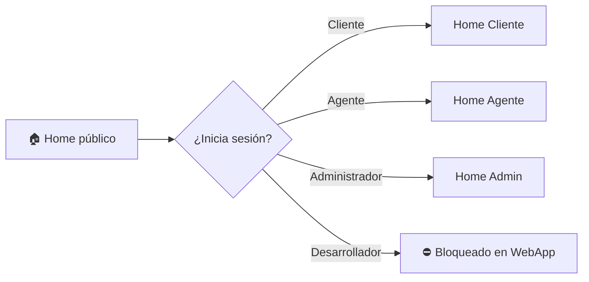

# ⚙️ Instalación y Ejecución — RealEstateApp

> Guía paso a paso para clonar, configurar y ejecutar la WebApp y la Web API en un entorno local.
>
> 📎 Volver al [README principal](../README.md) · Ver [Arquitectura](01-arquitectura.md) · Ver [API REST](08-api-rest.md)

---

## 📑 Índice

- [Requisitos previos](#-requisitos-previos)
- [Stack tecnológico](#-stack-tecnológico)
- [Clonar el repositorio](#-clonar-el-repositorio)
- [Configuración (appsettings / user-secrets)](#-configuración-appsettings--user-secrets)
- [Base de datos y migraciones](#-base-de-datos-y-migraciones)
- [Ejecutar la WebApp](#-ejecutar-la-webapp)
- [Ejecutar la Web API](#-ejecutar-la-web-api)
- [Usuarios sembrados (Seed)](#-usuarios-sembrados-seed)
- [Solución de problemas](#-solución-de-problemas)

---

## ✅ Requisitos previos

| Herramienta | Versión mínima | Uso |
|-------------|----------------|-----|
| 🟣 **.NET SDK** | **9.0** | Compilar y ejecutar la solución |
| 🗄️ **SQL Server** | 2019 / Express / LocalDB | Persistencia de negocio e Identity |
| 🛠️ **EF Core Tools** | 9.0 (`dotnet tool install --global dotnet-ef`) | Migraciones |
| 💻 **IDE** | Visual Studio 2022 (17.14+) o VS Code | Desarrollo |
| ✉️ **Cuenta SMTP** | Gmail / Mailtrap / otro | Correos de activación de clientes |

---

## 🧰 Stack tecnológico

| Categoría | Tecnología | Versión |
|-----------|-----------|--------:|
| Framework | ASP.NET Core (MVC + Web API) | **9.0** |
| ORM | Entity Framework Core (**Code First**) | 9.0.17 |
| Base de datos | SQL Server | — |
| Identidad | ASP.NET Core Identity | 9.0.17 |
| Tokens API | JWT (`Microsoft.AspNetCore.Authentication.JwtBearer`) | 9.0.17 |
| Mapeo | AutoMapper | 16.2.0 |
| Correos | MailKit + MimeKit | 4.17.0 |
| Versionado API | Asp.Versioning | 8.1.0 |
| Documentación API | Swashbuckle (Swagger) | 9.0.6 |
| UI | Bootstrap 5 + jQuery + CSS propio | — |

---

## 📥 Clonar el repositorio

```bash
git clone https://github.com/JoelAlBenitez/RealEstateApp.git
cd RealEstateApp
```

> La solución raíz es `RealEstateApp.sln` y el código vive en `Source/`.

---

## 🔧 Configuración (appsettings / user-secrets)

La aplicación requiere **tres bloques de configuración**: cadena de conexión, correo (SMTP) y JWT. Por seguridad, los secretos se manejan con **User Secrets** (no se comitean).

### 1️⃣ Cadena de conexión

```jsonc
// appsettings.json  (WebApp y API)
{
  "ConnectionStrings": {
    "DefaultConnection": "Server=localhost;Database=RealEstateAppDb;Trusted_Connection=True;TrustServerCertificate=True;"
  }
}
```

### 2️⃣ Configuración de correo (`EmailSettings`)

```jsonc
{
  "EmailSettings": {
    "SmtpServer": "smtp.gmail.com",
    "Port": 587,
    "SenderName": "RealEstateApp",
    "SenderEmail": "no-reply@realestateapp.com",
    "Username": "tu-usuario-smtp",
    "Password": "tu-app-password",
    "EnableSsl": true
  }
}
```

### 3️⃣ Configuración JWT (`JwtSettings`) — solo API

```bash
# Los secretos JWT se cargan mediante user-secrets en el proyecto de la API
cd Source/Presentation/RealEstateApp.Presentation.Api
dotnet user-secrets init
dotnet user-secrets set "JwtSettings:SecretKey"  "UNA_CLAVE_LARGA_Y_SECRETA_DE_AL_MENOS_32_CARACTERES"
dotnet user-secrets set "JwtSettings:Issuer"     "RealEstateApp.Api"
dotnet user-secrets set "JwtSettings:Audience"   "RealEstateApp.Client"
dotnet user-secrets set "JwtSettings:DurationInMinutes" "60"
```

> 🔐 `JwtSettings` está definido como clase `sealed` con propiedades `required` en `Core.Domain/Settings/JWT`. Si algún valor falta, la app no arranca — es intencional para no ejecutar la API sin firma de tokens.

---

## 🗄️ Base de datos y migraciones

El proyecto usa **Code First**. Existen **dos contextos**: el de negocio (`DbContextRealEstateApp`) y el de Identity. Aplica ambas migraciones:

```bash
# Desde la raíz de la solución

# Contexto de NEGOCIO (Persistence)
dotnet ef database update ^
  --project Source/Infraestructure/RealEstateApp.Infraestructure.Persistence ^
  --startup-project Source/Presentation/RealEstateApp.Presentation.WebApp

# Contexto de IDENTITY
dotnet ef database update ^
  --project Source/Infraestructure/RealEstateApp.Infraestructure.Identity ^
  --startup-project Source/Presentation/RealEstateApp.Presentation.WebApp
```

> 💡 Los seeds de roles y usuarios por defecto se ejecutan **automáticamente** al iniciar la aplicación (`await app.Services.GenerateDataSeedUsers();`).

---

## 🖥️ Ejecutar la WebApp

```bash
cd Source/Presentation/RealEstateApp.Presentation.WebApp
dotnet run
```

Abre el navegador en `https://localhost:xxxx`. Aterrizas en el **Home público** (listado de propiedades disponibles), sin necesidad de iniciar sesión.



---

## 🔌 Ejecutar la Web API

```bash
cd Source/Presentation/RealEstateApp.Presentation.Api
dotnet run
```

En modo *Development* se habilita **Swagger** automáticamente. Abre `https://localhost:xxxx/swagger`.

**Flujo de uso de la API:**

1. `POST /api/v1/Account/Authenticate` con usuario y contraseña → obtienes un **token JWT**.
2. Clic en **Authorize** 🔓 en Swagger e ingresa `Bearer {token}`.
3. Consume los endpoints protegidos según tu rol.

También expone un endpoint de salud: `GET /health`.

---

## 👥 Usuarios sembrados (Seed)

Al arrancar cualquiera de los dos frontends se crean **roles** (`Cliente`, `Agente`, `Administrador`, `Desarrollador`) y **usuarios por defecto** en estado **Activo**:

| Usuario por defecto | Rol | Estado | Puede usar |
|---------------------|-----|--------|-----------|
| Administrador | Administrador | ✅ Activo | WebApp + API |
| Agente | Agente | ✅ Activo | WebApp |
| Cliente | Cliente | ✅ Activo | WebApp |
| Desarrollador | Desarrollador | ✅ Activo | Solo API |

> Las credenciales exactas viven en las clases `Seeds/DefaultUser*.cs` del proyecto Identity. Revísalas antes del primer login.

---

## 🩹 Solución de problemas

| Síntoma | Causa probable | Solución |
|---------|----------------|----------|
| La app no arranca y falla en `JwtSettings` | Faltan user-secrets JWT | Configura los 4 valores de `JwtSettings` (ver arriba) |
| `Cannot open database` | BD no creada / migraciones sin aplicar | Ejecuta `dotnet ef database update` en **ambos** contextos |
| No llegan correos de activación | SMTP mal configurado | Verifica `EmailSettings` y usa un *app-password* si es Gmail |
| `401` en todos los endpoints de la API | Token ausente o expirado | Autentícate de nuevo y usa el esquema `Bearer` |
| Desarrollador no puede entrar a la WebApp | ✅ Comportamiento esperado | El rol Desarrollador solo accede a la API |
| Imágenes no se muestran | Carpeta `wwwroot/Img/Users` sin permisos | Verifica escritura en `wwwroot` |

---

📎 Continúa en: [API REST](08-api-rest.md) · [Seguridad](09-seguridad.md) · [Arquitectura](01-arquitectura.md)
