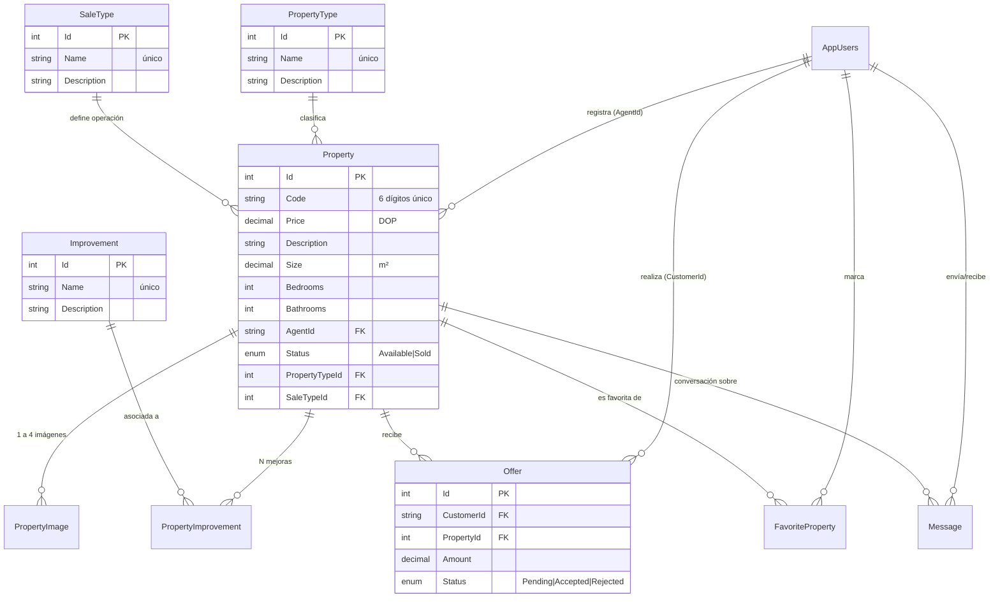
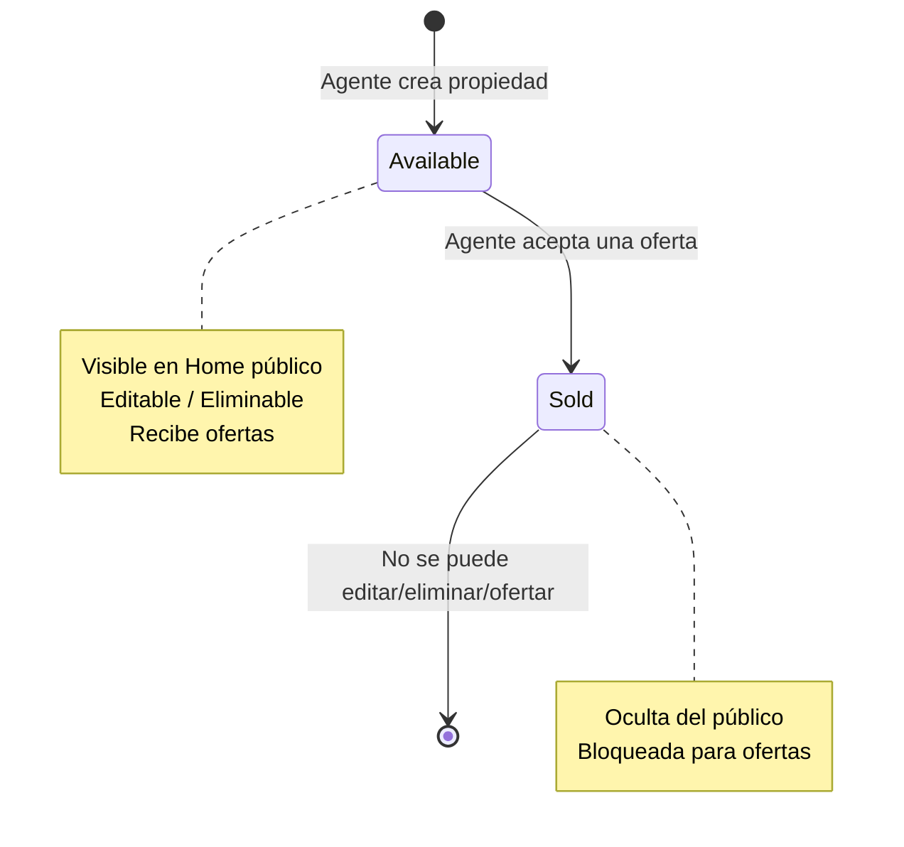
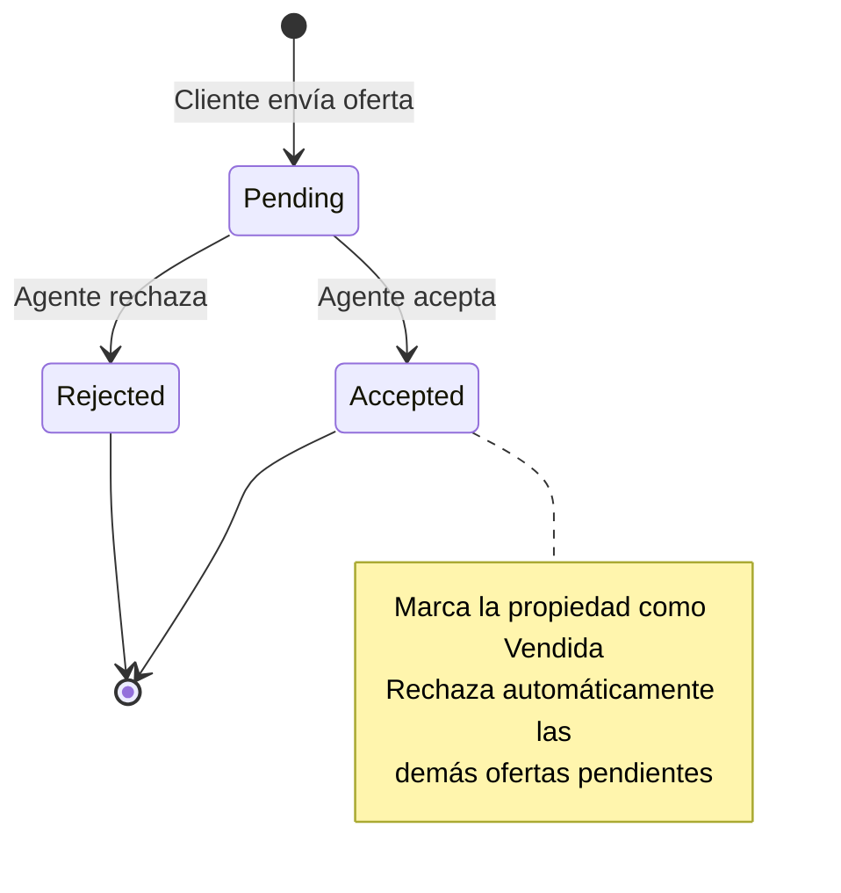

# 🗄️ Modelo de Datos — RealEstateApp

> Descripción de las entidades de dominio, sus relaciones, enumeraciones y estrategia de persistencia con **Entity Framework Core (Code First)**.
>
> 📎 Volver al [README principal](../README.md) · Ver [Arquitectura](01-arquitectura.md)

---

## 📑 Índice

- [Diagrama entidad-relación](#-diagrama-entidad-relación)
- [Entidades de dominio](#-entidades-de-dominio)
- [Entidad de identidad](#-entidad-de-identidad-appusers)
- [Enumeraciones](#-enumeraciones)
- [Estrategia de persistencia](#-estrategia-de-persistencia)
- [Reglas de integridad y borrado en cascada](#-reglas-de-integridad-y-borrado-en-cascada)

---

## 🔗 Diagrama entidad-relación



---

## 💠 Entidades de dominio

Todas heredan de `BaseEntitie<TKey>`, que aporta identidad y auditoría temporal:

```csharp
public class BaseEntitie<TKey>
{
    public TKey? Id { get; set; }
    public required DateTimeOffset CreateAt { get; set; }
    public required DateTimeOffset UpdateAt { get; set; }
}
```

| Entidad | Descripción | Relaciones clave |
|---------|-------------|------------------|
| 🏠 **Property** | Propiedad inmobiliaria. Código único de 6 dígitos, precio en DOP, estado `Available`/`Sold`. | → PropertyType, SaleType, Images, Improvements, Offers |
| 🖼️ **PropertyImage** | Imágenes de una propiedad (mínimo 1, máximo 4). | Property |
| 🏷️ **PropertyType** | Catálogo: Casa, Apartamento, Villa, Solar… (nombre único). | Properties |
| 💰 **SaleType** | Catálogo de operación: Venta, Alquiler, Alquiler con opción a compra. | Properties |
| ✨ **Improvement** | Mejora/característica: Piscina, Ascensor, Terraza… (nombre único). | PropertyImprovement |
| 🔗 **PropertyImprovement** | Tabla puente N:N entre Property e Improvement. | Property, Improvement |
| 💵 **Offer** | Oferta de un cliente sobre una propiedad. Estados `Pending`/`Accepted`/`Rejected`. | Property |
| ⭐ **FavoriteProperty** | Marca de favorito de un cliente sobre una propiedad. | Property, Cliente |
| 💬 **Message** | Mensaje de chat entre cliente y agente sobre una propiedad. | Property, Cliente, Agente |

### Ejemplo — Entidad `Property`

```csharp
public class Property : BaseEntitie<int>
{
    public required string  Code { get; set; }        // 6 dígitos, único
    public required decimal Price { get; set; }        // DOP
    public required string  Description { get; set; }
    public required decimal Size { get; set; }         // m² (decimal — refactorizado desde int)
    public required int     Bedrooms { get; set; }
    public required int     Bathrooms { get; set; }
    public required string  AgentId { get; set; }      // FK a AppUsers (Identity)
    public required PropertyState Status { get; set; } // Available | Sold
    public required int     PropertyTypeId { get; set; }
    public required int     SaleTypeId { get; set; }

    // Navegación
    public PropertyType? PropertyType { get; set; }
    public SaleType? SaleType { get; set; }
    public IReadOnlyCollection<PropertyImage> Images { get; set; } = null!;
    public IReadOnlyCollection<PropertyImprovement> PropertyImprovements { get; set; } = null!;
    public IReadOnlyCollection<Offer> Offers { get; set; } = null!;
}
```

> 🧩 **Decisión de diseño:** `AgentId` y `CustomerId` son `string` porque referencian el `Id` de `AppUsers` (ASP.NET Identity usa `string`/GUID). El dominio no referencia a Identity directamente; la relación es lógica por Id.

---

## 🔐 Entidad de identidad (`AppUsers`)

Vive en el proyecto **Identity** (extiende `IdentityUser`) y **no** en el Dominio, para mantener el Core libre de dependencias de infraestructura:

```csharp
public sealed class AppUsers : IdentityUser
{
    public required string Name { get; set; }
    public required string LastName { get; set; }
    public required string ProfileImg { get; set; }
    public string? IDCard { get; set; }               // Cédula (admin/desarrollador)
    public required bool IsActive { get; set; }        // Activo/Inactivo
    public DateTimeOffset? BlockedEmailSending { get; set; }
    public required DateTimeOffset CreateAt { get; set; }
}
```

---

## 🎚️ Enumeraciones

```csharp
public enum Roles          { Cliente = 1, Agente = 2, Administrador = 3, Desarrollador = 4 }
public enum PropertyState  { Available = 1, Sold = 2 }
public enum OfferState     { Pending = 1, Accepted = 2, Rejected = 3 }
```

> Los valores son **explícitos** para estabilidad en migraciones y en la serialización JSON de la API (se usa `JsonStringEnumConverter`, por lo que el cliente recibe `"Available"` en lugar de `1`).

### Ciclo de vida del estado de una propiedad



### Ciclo de vida de una oferta



---

## 🛠️ Estrategia de persistencia

- **Enfoque:** Code First con `DbContextRealEstateApp`.
- **Configuraciones:** cada entidad tiene su `IEntityTypeConfiguration<T>` en `Persistence/Configurations`, aplicadas con:
  ```csharp
  modelBuilder.ApplyConfigurationsFromAssembly(Assembly.GetExecutingAssembly());
  ```
- **DbSets registrados:** `Properties`, `PropertyImages`, `Offers`, `FavoriteProperties`, `Messages`, `PropertyImprovements`, `Improvements`, `SaleTypes`, `PropertyTypes`.
- **Repositorios:** un genérico `IGenericRepository<TEntity,TKey>` + repositorios específicos por entidad para consultas con `Include` y filtros compuestos (`PropertyFilterCriteria`).

```csharp
public interface IGenericRepository<TEntity, TKey> where TEntity : class
{
    Task AddAsync(TEntity entity);
    Task<int> SaveAsync();
    Task<bool> UpdateAsync(TEntity entity);
    Task<IReadOnlyCollection<TEntity>> GetAllAsync();
    Task<bool> DeleteAsync(TEntity entity);
    Task<TEntity> GetByIdAsync(TKey key);
}
```

---

## 🧹 Reglas de integridad y borrado en cascada

Estas reglas son **críticas** para evitar registros huérfanos (fueron un foco de las evaluaciones de calidad del proyecto):

| Al eliminar… | Debe gestionarse en cascada |
|--------------|-----------------------------|
| 🧑‍💼 **Agente** | Sus propiedades, imágenes, mejoras asociadas, ofertas, conversaciones y favoritos de clientes |
| 🏷️ **Tipo de propiedad** | Propiedades de ese tipo + imágenes, ofertas, mensajes, favoritos |
| 💰 **Tipo de venta** | Propiedades de ese tipo + datos relacionados |
| ✨ **Mejora** | **Solo** la relación `PropertyImprovement` — ⚠️ las propiedades **NO** se eliminan |

> El servicio `PropertyCascadeService` centraliza esta lógica de borrado consistente. Ver detalle en el [Módulo Administrador](07-modulo-administrador.md).

---

📎 Continúa en: [Módulo Administrador](07-modulo-administrador.md) · [Módulo Agente](06-modulo-agente.md) · [Módulo Cliente](05-modulo-cliente.md)
