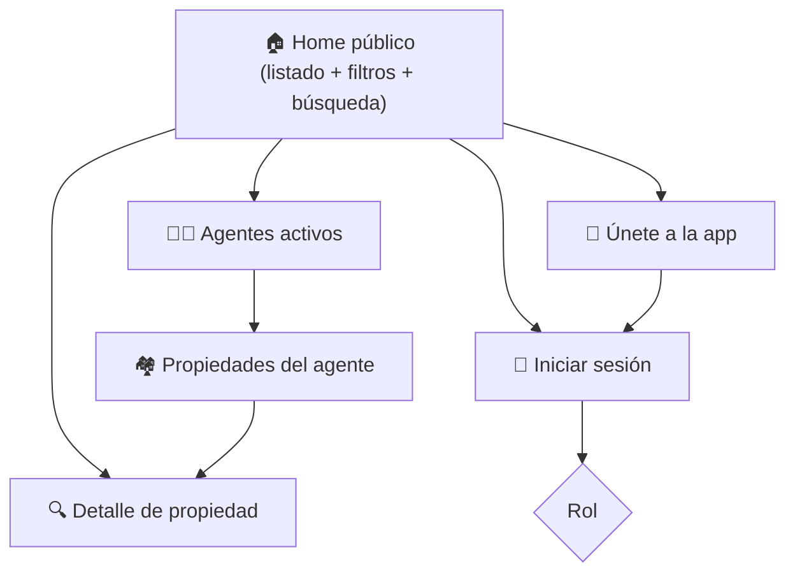
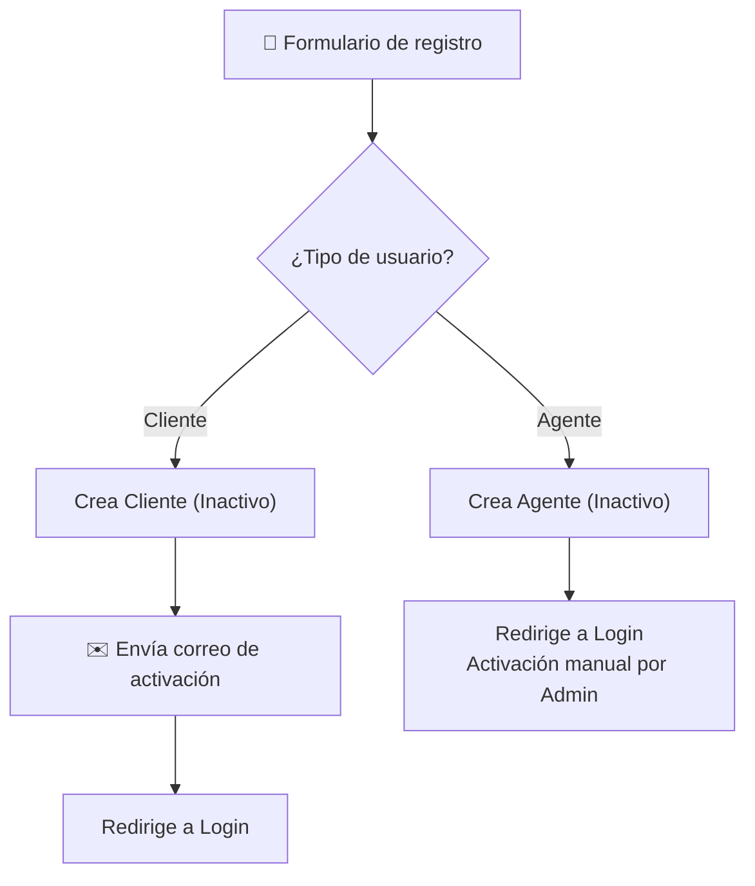

# 🌐 Funcionalidades Generales (Portal Público)

> **Desarrollador responsable:** 👑 [**Joel Benítez** (`@JoelAlBenitez`)](https://github.com/JoelAlBenitez) — Líder técnico
>
> Módulos: Home público · Agentes públicos · Únete a la app · Iniciar sesión. Además Joel diseñó los **wireframes** que dieron lugar a toda la UI/UX del sistema.
>
> 📎 Volver al [README principal](../README.md) · Ver [Seguridad](09-seguridad.md) · Ver [Equipo y Decisiones](10-equipo-y-decisiones.md)

---

## 📑 Índice

- [Alcance del módulo](#-alcance-del-módulo)
- [🏠 Home público](#-home-público)
- [🧑‍💼 Agentes públicos](#-agentes-públicos)
- [📝 Únete a la app (registro)](#-únete-a-la-app-registro)
- [🔑 Iniciar sesión (Login)](#-iniciar-sesión-login)
- [Problemas resueltos y decisiones](#-problemas-resueltos-y-decisiones)

---

## 🎯 Alcance del módulo

Este es el **rostro público** de la aplicación: todo lo accesible **sin iniciar sesión**. Es responsabilidad del líder técnico porque define la primera impresión, las convenciones visuales (wireframes → UI/UX) y las reglas de acceso que el resto de módulos reutilizan.

| Controlador | Ruta | Vistas |
|-------------|------|--------|
| `HomeController` | `/Home` | Home, StatusCodeError, AccessDenied |
| `AgentFunctionsPublicController` | `/AgentFunctionsPublic` | Listado y detalle público de agentes |
| `AccountController` | `/Account` | Register, Login, ConfirmEmail |

---

## 🏠 Home público

Pantalla inicial pública con el listado de propiedades **disponibles**, ordenadas de la **más reciente a la más antigua**.

### Funcionalidades

- 📋 **Listado de propiedades disponibles** — muestra: tipo, imagen principal, código, tipo de venta, precio (DOP), habitaciones, baños y tamaño (m²).
- 🔎 **Búsqueda por código** — busca una propiedad de 6 dígitos **solo entre disponibles**.
- 🎚️ **Filtros combinables** — tipo de propiedad, precio mínimo/máximo, habitaciones y baños. Aplicables individual o simultáneamente.
- 🧹 **Limpiar filtros** — restaura el listado completo.
- 🖼️ **Detalle público** — galería de imágenes, todos los datos de la propiedad, mejoras y datos de contacto del agente.

### Reglas de negocio clave

| Regla | Comportamiento |
|-------|----------------|
| Solo propiedades `Available` | Las `Sold` **nunca** aparecen en el público |
| Búsqueda vacía | Mantiene el listado general |
| Código inexistente / no disponible | Mensaje: *"No se encontró ninguna propiedad disponible con el código ingresado."* |
| Precio mínimo > máximo | Rechazado por validación |
| Sin resultados de filtro | Mensaje: *"No se encontraron propiedades disponibles con los filtros seleccionados."* |

> 🔁 **Reutilización:** el mismo componente de filtros y tarjeta de propiedad (`_PropertyCard.cshtml`, `_CustomerPropertyFilter.cshtml`) se reutiliza en el Home del Cliente, propiedades del agente y "Mis propiedades" favoritas — cumpliendo el requisito de *"todas las pantallas que listan propiedades incluyen los mismos filtros"*.

---

## 🧑‍💼 Agentes públicos

Listado público de **agentes activos**, ordenados alfabéticamente.

- 👤 Muestra foto y nombre de cada agente activo.
- 🔎 Búsqueda por nombre o apellido (solo activos).
- 🏘️ Al seleccionar un agente → sus **propiedades disponibles**.
- 🔍 Desde ahí se accede al mismo **detalle** del Home.

| Regla | Comportamiento |
|-------|----------------|
| Solo agentes `Activo` | Los inactivos no aparecen |
| Agente sin propiedades | *"Este agente no tiene propiedades disponibles en este momento."* |
| Agente inexistente/inactivo | *"El agente solicitado no existe o no se encuentra disponible."* |

---

## 📝 Únete a la app (registro)

Registro público que crea usuarios **Cliente** o **Agente**, siempre en estado **Inactivo**.

### Validaciones (implementadas en el ViewModel con DataAnnotations)

- Nombre, apellido, teléfono, foto, usuario, correo, contraseña y confirmación → **requeridos**.
- 🔒 **Usuario único** y **correo único** (formato válido).
- 🔑 Contraseña y confirmación deben **coincidir**.
- 🖼️ Foto debe ser una **imagen válida** (`.jpg`, `.jpeg`, `.png`).
- ⛔ Desde aquí **no** se puede crear Administrador ni Desarrollador.

### Diferencia de activación

| Rol | Activación |
|-----|-----------|
| 👤 **Cliente** | Automática vía **correo de activación** (MailKit) |
| 🧑‍💼 **Agente** | **Manual** por un Administrador |

> ✉️ El envío de correos usa el `EmailService` de la capa **Shared** (MailKit/MimeKit), desacoplado mediante `IEmailService` en Application.

---

## 🔑 Iniciar sesión (Login)

Autenticación con **ASP.NET Identity** para Cliente, Agente y Administrador.

- Acepta **correo electrónico o nombre de usuario** + contraseña.
- Valida credenciales, estado **Activo** y rol.
- 🔀 Redirige según rol (ver diagrama de arriba).
- 🚪 Cierre de sesión → vuelve al Home público.

### Reglas y mensajes

| Situación | Mensaje / Código |
|-----------|-----------------|
| Campos vacíos | *"Debe ingresar su correo o nombre de usuario y contraseña."* |
| Credenciales incorrectas | *"Los datos de acceso son inválidos."* |
| Usuario inactivo | *"El usuario se encuentra inactivo y no puede iniciar sesión."* |
| Rol Desarrollador en WebApp | ⛔ *"No tiene permisos para acceder."* |

> 🔐 La sesión de usuario se gestiona con `IUserSession` (scoped) + cookies configuradas de forma segura (`HttpOnly`, `SecurePolicy.Always`, `SameSite.Lax`, expiración 30 min).

---

## 🧩 Problemas resueltos y decisiones

| Problema a resolver | Decisión de Joel |
|---------------------|------------------|
| Evitar duplicar la vista de listado en 4 pantallas | Componentes parciales reutilizables (`_PropertyCard`, `_CustomerPropertyFilter`) |
| Wireframes → UI consistente | Diseño previo de wireframes + CSS modular por sección (`wwwroot/css/home`, `/agents`, `/account`…) |
| Clientes y agentes con activación distinta | Un solo formulario, dos flujos de activación (correo vs. manual) |
| Desarrollador no debe entrar a la WebApp | Bloqueo explícito en el login por rol |
| Login flexible | Aceptar indistintamente correo **o** username |

> 👑 Como líder técnico, Joel también definió las **convenciones de código**, ejecutó el **code review** de todo el equipo y veló por el **cumplimiento estricto de las reglas de negocio** en todos los módulos.

---

📎 Continúa en: [Seguridad](09-seguridad.md) · [API REST](08-api-rest.md) · [Módulo Cliente](05-modulo-cliente.md)
