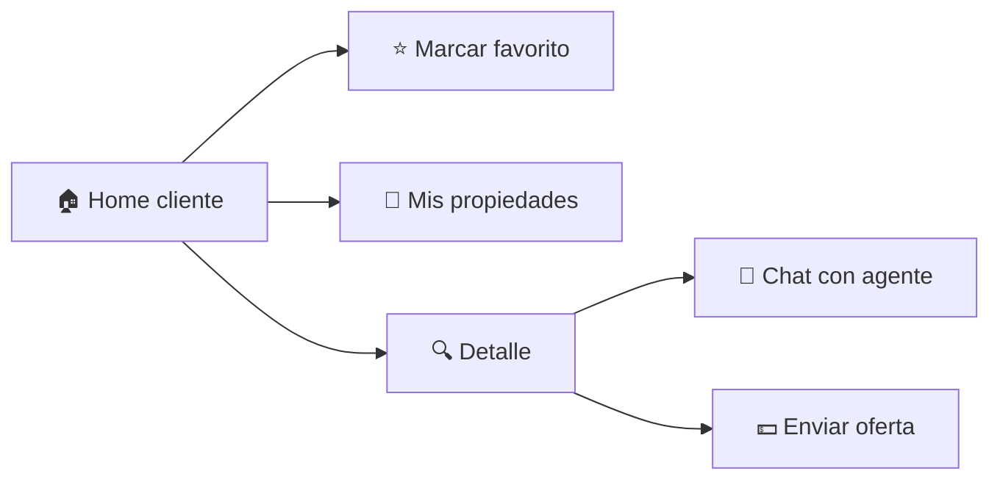
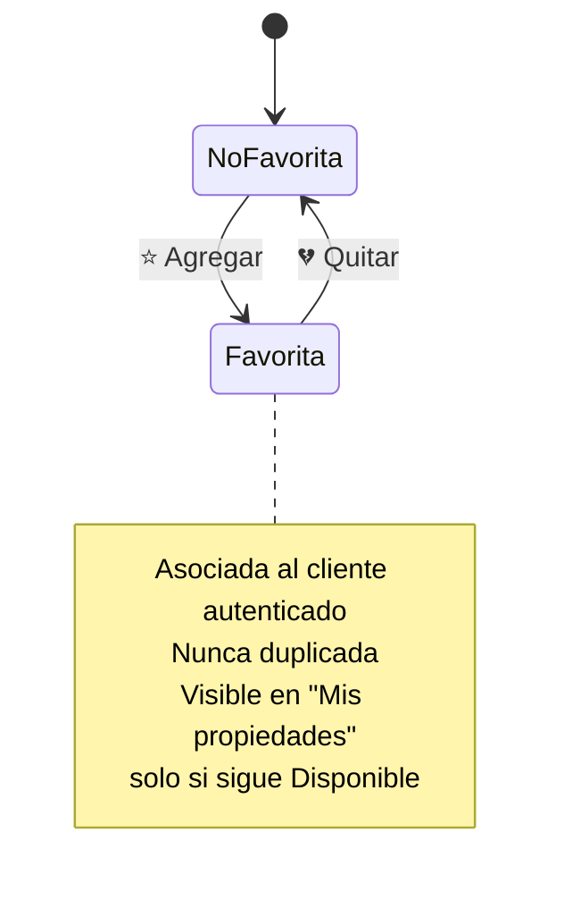
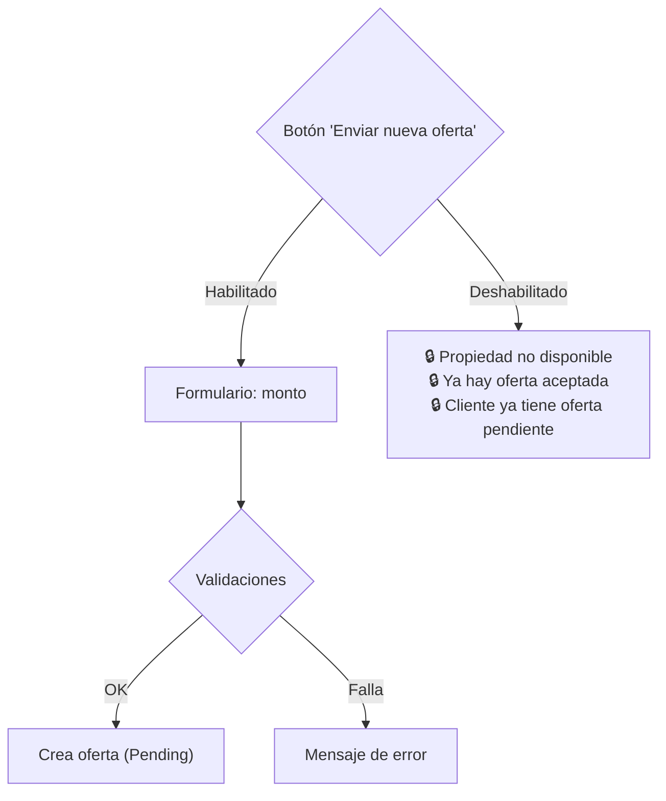

# 👤 Módulo Cliente

> **Desarrollador responsable:** 🧑‍💻 [**Sebastián Peguero** (`@SebasPeguero`)](https://github.com/SebasPeguero)
>
> Funcionalidades del **Cliente**: home autenticado, favoritos, detalle con chat y ofertas.
>
> 📎 Volver al [README principal](../README.md) · Ver [Módulo Agente](06-modulo-agente.md) · Ver [Modelo de Datos](03-modelo-de-datos.md)

---

## 📑 Índice

- [Alcance del módulo](#-alcance-del-módulo)
- [🏠 Home del cliente](#-home-del-cliente)
- [⭐ Propiedades favoritas](#-propiedades-favoritas)
- [🔍 Detalle de propiedad del cliente](#-detalle-de-propiedad-del-cliente)
- [💬 Chat con el agente](#-chat-con-el-agente)
- [💵 Ofertas](#-ofertas)
- [Problemas resueltos y decisiones](#-problemas-resueltos-y-decisiones)

---

## 🎯 Alcance del módulo

El Cliente es un usuario autenticado que **consulta, guarda favoritos, conversa con agentes y realiza ofertas**. Todo el módulo exige rol `Cliente` activo.

| Controlador | Responsabilidad |
|-------------|-----------------|
| `CustomerController` | Home del cliente, "Mis propiedades" (favoritas), detalle |
| `FavoriteController` | Marcar / desmarcar favoritos |
| `MessagesController` | Envío y consulta de mensajes (chat) |
| `OfferController` | Creación y listado de ofertas |

---

## 🏠 Home del cliente

Mismo listado de propiedades disponibles del Home público, **más** la capacidad de marcar favoritos. Reutiliza los filtros y tarjetas del portal público.

- 📋 Solo propiedades `Available`, de más reciente a más antigua.
- 🎚️ Filtros idénticos al Home público (tipo, precio, habitaciones, baños).
- ⭐ Botón de favorito en cada tarjeta.

---

## ⭐ Propiedades favoritas

| Regla | Comportamiento |
|-------|----------------|
| Solo rol Cliente | La acción de favorito es exclusiva de clientes |
| No duplicar | Un cliente no puede tener la misma propiedad dos veces |
| "Mis propiedades" | Solo favoritas que **siguen disponibles** |
| Favorita vendida | Se **oculta** automáticamente de "Mis propiedades" |
| Sin favoritas | *"No tiene propiedades favoritas disponibles en este momento."* |

Mensajes: *"La propiedad fue agregada a sus favoritas correctamente."* / *"…eliminada de sus favoritas correctamente."*

---

## 🔍 Detalle de propiedad del cliente

Muestra toda la información pública de la propiedad **+** dos secciones exclusivas del cliente: **chat** y **ofertas**. Solo disponibles si la propiedad está `Available`.

---

## 💬 Chat con el agente

- ✍️ El cliente escribe mensajes al **agente responsable** de la propiedad.
- 👀 Ve el hilo de conversación de **esa** propiedad (aislado por cliente-agente-propiedad).
- El mensaje queda asociado a **cliente + agente + propiedad**.

| Validación | Regla |
|-----------|-------|
| Autenticación | Cliente autenticado con rol Cliente |
| Propiedad | Debe existir y estar `Available` |
| Mensaje | Requerido, no vacío → *"Debe escribir un mensaje antes de enviarlo."* |

---

## 💵 Ofertas

El cliente puede ofertar sobre una propiedad disponible. La oferta nace en estado **`Pending`** con fecha automática.

### Validaciones de la oferta

| Regla | Mensaje si falla |
|-------|------------------|
| Monto requerido | *"Debe ingresar el monto de la oferta."* |
| Monto > 0 | *"El monto de la oferta debe ser un valor numérico mayor que cero."* |
| Sin oferta pendiente propia | *"Ya tiene una oferta pendiente para esta propiedad."* |
| Sin oferta aceptada en la propiedad | *"Esta propiedad ya tiene una oferta aceptada y no permite nuevas ofertas."* |
| Propiedad disponible | *"Esta propiedad ya no se encuentra disponible para recibir ofertas."* |

- 📜 El cliente ve **solo sus propias ofertas** para esa propiedad, con estado `Pending`/`Accepted`/`Rejected`.
- Las ofertas **rechazadas permanecen** en el historial.

> ⚙️ La lógica de habilitación del botón y las validaciones viven en `OfferValidationService`; la ejecución en `OfferService`. Esta separación (validar vs. ejecutar) es el patrón usado en todo el módulo.

---

## 🧩 Problemas resueltos y decisiones

| Problema a resolver | Decisión de Sebastián |
|---------------------|------------------------|
| Un cliente no debe spamear ofertas | Bloqueo de nueva oferta si tiene una `Pending` |
| Aislar conversaciones | El chat filtra por la terna cliente-agente-propiedad |
| Favoritas "fantasma" (vendidas) | "Mis propiedades" filtra por estado `Available` en tiempo de consulta |
| Reglas complejas de ofertas | Servicio de validación dedicado con códigos de error reutilizables |
| Coherencia visual con el portal | Reutilización de parciales de listado/filtro definidos por el líder técnico |

---

📎 Continúa en: [Módulo Agente](06-modulo-agente.md) · [Módulo Administrador](07-modulo-administrador.md)
