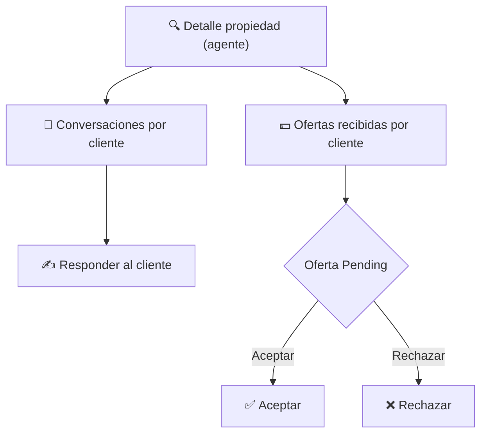
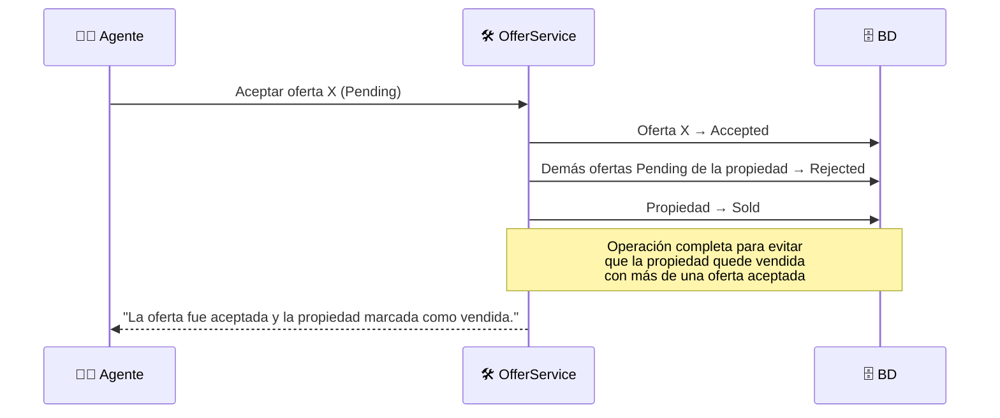
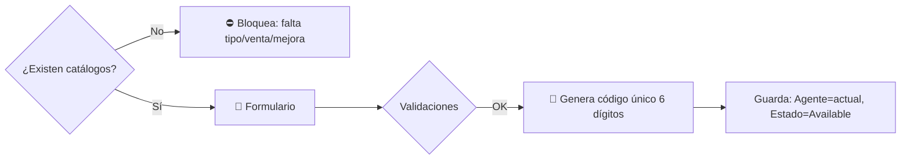

# 🧑‍💼 Módulo Agente

> **Desarrollador responsable:** 🧑‍💻 [**Sebastián Peguero** (`@SebasPeguero`)](https://github.com/SebasPeguero)
>
> Funcionalidades del **Agente**: home, detalle con gestión de ofertas/conversaciones, mantenimiento de propiedades y perfil.
>
> 📎 Volver al [README principal](../README.md) · Ver [Módulo Cliente](05-modulo-cliente.md) · Ver [Modelo de Datos](03-modelo-de-datos.md)

---

## 📑 Índice

- [Alcance del módulo](#-alcance-del-módulo)
- [🏠 Home del agente](#-home-del-agente)
- [🔍 Detalle de propiedad del agente](#-detalle-de-propiedad-del-agente)
- [💵 Gestión de ofertas recibidas](#-gestión-de-ofertas-recibidas)
- [🏗️ Mantenimiento de propiedades](#️-mantenimiento-de-propiedades)
- [👤 Mi perfil](#-mi-perfil)
- [Problemas resueltos y decisiones](#-problemas-resueltos-y-decisiones)

---

## 🎯 Alcance del módulo

El Agente gestiona **sus propias** propiedades, responde a clientes y decide sobre las ofertas. Todo exige rol `Agente` activo, y **nunca** puede tocar propiedades de otros agentes.

| Controlador | Responsabilidad |
|-------------|-----------------|
| `AgentController` | Home del agente (propiedades propias) |
| `AgentPropertyController` | CRUD de propiedades (mantenimiento) |
| `AgentConversationsController` | Conversaciones con clientes |
| `AgentOffersController` | Ofertas recibidas + aceptar/rechazar |

---

## 🏠 Home del agente

Panel principal con **todas** las propiedades del agente autenticado — `Available` **y** `Sold` (a diferencia del público).

- 🏷️ Las propiedades `Sold` muestran una **etiqueta visual "Vendida"**.
- 🔒 Solo ve **sus** propiedades (aislamiento por `AgentId`).
- Sin propiedades → *"No tiene propiedades registradas en este momento."*

---

## 🔍 Detalle de propiedad del agente

Muestra datos completos + dos secciones de gestión:

- 💬 Lista de clientes que iniciaron conversación (nombre, último mensaje, fecha). Al entrar, hilo completo + respuesta.
- 💵 Lista de clientes con ofertas (cantidad, última oferta, estado). Al entrar, historial completo con acciones.

---

## 💵 Gestión de ofertas recibidas

La **operación crítica** del sistema: aceptar una oferta debe ejecutarse de forma **atómica y consistente**.

| Acción | Efecto |
|--------|--------|
| ❌ **Rechazar** | La oferta pasa a `Rejected` |
| ✅ **Aceptar** | Oferta → `Accepted` · **todas** las demás `Pending` → `Rejected` · propiedad → `Sold` · se bloquean nuevas ofertas |

### Validaciones

- Solo ofertas en estado `Pending` permiten acción.
- La propiedad debe pertenecer al agente y estar `Available`.
- Oferta ya respondida → *"Esta oferta ya fue respondida."*
- Aceptar sobre vendida → *"No se puede aceptar una oferta para una propiedad que ya fue vendida."*

> ⚙️ El *"al aceptar, rechazar automáticamente las demás y marcar vendida"* es una regla que las evaluaciones de calidad vigilaron especialmente — se resuelve en una única operación de servicio.

---

## 🏗️ Mantenimiento de propiedades

CRUD completo de propiedades del agente. Solo lista propiedades `Available` (las vendidas no se editan ni eliminan).

### Crear propiedad

- Campos: tipo de propiedad, tipo de venta, precio (DOP), descripción, tamaño (m²), habitaciones, baños, mejoras (múltiple) e **imágenes (1 a 4)**.
- 🔢 **Código único de 6 dígitos** generado automáticamente (no editable, no repetible).
- 🧑‍💼 Se asigna **automáticamente** al agente autenticado, en estado `Available`.
- ⛔ Si no hay tipos/ventas/mejoras registrados, se bloquea la creación con mensaje guía.

### Editar / Eliminar

| Operación | Reglas |
|-----------|--------|
| ✏️ **Editar** | Solo propiedades propias y `Available`. Imágenes opcionales (mantiene ≥1, máx 4). Código no cambia. |
| 🗑️ **Eliminar** | Con confirmación. Prohibido sobre vendidas. Solo propias. |

Mensajes de acceso: *"No tiene permisos para modificar esta propiedad."* / *"No se puede modificar una propiedad que ya fue vendida."*

> 🖼️ La carga y almacenamiento de imágenes usa el `FileManagerService` de la capa **Shared**, desacoplado por `IFileManagerService`.

---

## 👤 Mi perfil

El agente actualiza nombre, apellido, teléfono y foto.

- 📷 La foto es **opcional** en edición: si no se carga una nueva, se conserva la actual.
- 🔒 Solo puede modificar **su propia** información.

---

## 🧩 Problemas resueltos y decisiones

| Problema a resolver | Decisión de Sebastián |
|---------------------|------------------------|
| Consistencia al aceptar oferta | Operación de servicio única: aceptar + rechazar resto + marcar vendida |
| Código único de propiedad | Generación de 6 dígitos con verificación de unicidad |
| Aislar datos entre agentes | Toda consulta/acción filtra por `AgentId` del usuario en sesión |
| No romper propiedades vendidas | Mantenimiento excluye vendidas y valida estado antes de editar/eliminar |
| Perfil sin perder la foto | Foto opcional que conserva la imagen previa si no se sube otra |

---

📎 Continúa en: [Módulo Administrador](07-modulo-administrador.md) · [Seguridad](09-seguridad.md)
