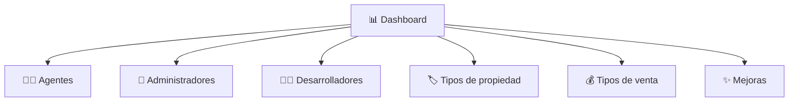
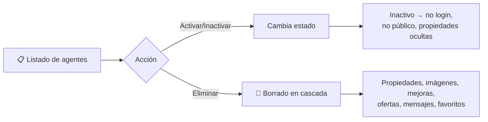
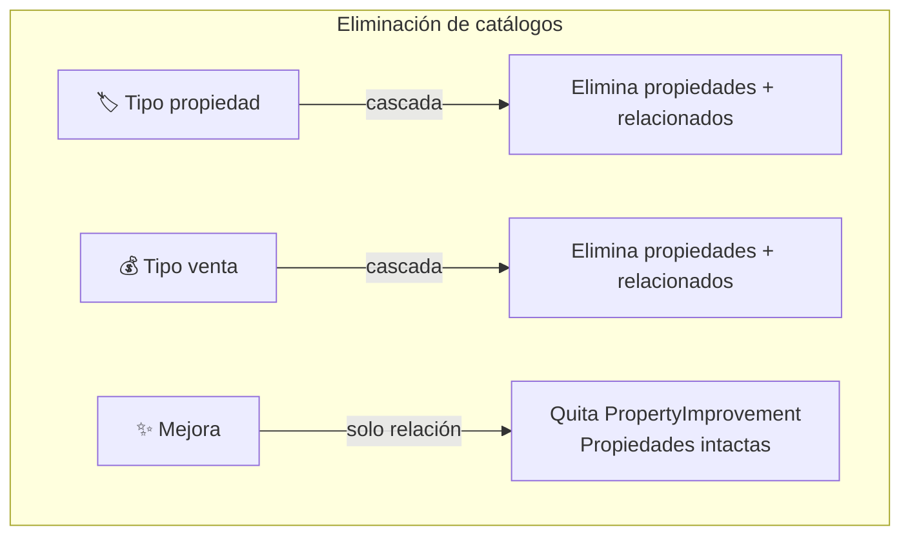

# 🛡️ Módulo Administrador

> **Desarrollador responsable:** 🧑‍💻 [**Adrián Brito** (`@Adrixn23`)](https://github.com/Adrixn23)
>
> Funcionalidades y **mantenimientos** del Administrador: dashboard, gestión de agentes, administradores, desarrolladores y catálogos (tipos de propiedad, tipos de venta, mejoras).
>
> 📎 Volver al [README principal](../README.md) · Ver [Modelo de Datos](03-modelo-de-datos.md) · Ver [Seguridad](09-seguridad.md)

---

## 📑 Índice

- [Alcance del módulo](#-alcance-del-módulo)
- [📊 Home del administrador (Dashboard)](#-home-del-administrador-dashboard)
- [🧑‍💼 Listado y gestión de agentes](#-listado-y-gestión-de-agentes)
- [👔 Mantenimiento de administradores](#-mantenimiento-de-administradores)
- [🧑‍💻 Mantenimiento de desarrolladores](#-mantenimiento-de-desarrolladores)
- [🗂️ Catálogos: tipos de propiedad, ventas y mejoras](#️-catálogos-tipos-de-propiedad-ventas-y-mejoras)
- [Problemas resueltos y decisiones](#-problemas-resueltos-y-decisiones)

---

## 🎯 Alcance del módulo

El Administrador es el **superusuario de la WebApp**: gestiona usuarios y los catálogos que alimentan la creación de propiedades. Todo exige rol `Administrador` activo.

| Controlador | Responsabilidad |
|-------------|-----------------|
| `AdminHomeController` | Dashboard con indicadores |
| `AgentManagementController` | Activar/inactivar/eliminar agentes |
| `AdministratorController` | CRUD de administradores |
| `DeveloperController` | CRUD de desarrolladores |
| `PropertyTypeController` | Catálogo de tipos de propiedad |
| `SaleTypeController` | Catálogo de tipos de venta |
| `ImprovementController` | Catálogo de mejoras |

---

## 📊 Home del administrador (Dashboard)

Panel con **indicadores en tiempo de carga** calculados por `DashboardService`:

| Indicador | Descripción |
|-----------|-------------|
| 🏠 Propiedades disponibles | Total en estado `Available` |
| 🔴 Propiedades vendidas | Total en estado `Sold` |
| 🟢 / ⚪ Agentes activos / inactivos | Conteo por estado |
| 🟢 / ⚪ Clientes activos / inactivos | Conteo por estado |
| 🟢 / ⚪ Desarrolladores activos / inactivos | Conteo por estado |

---

## 🧑‍💼 Listado y gestión de agentes

Lista **todos** los agentes (activos e inactivos) con nombre, apellido, correo, **cantidad de propiedades** y estado.

| Operación | Efecto |
|-----------|--------|
| ⏸️ **Inactivar** | No puede iniciar sesión, no aparece en público, sus propiedades se ocultan |
| ▶️ **Activar** | Restaura acceso y visibilidad |
| 🗑️ **Eliminar** | Borra el agente **y en cascada** todas sus propiedades y datos relacionados |

> 🧹 **Borrado en cascada** — resuelto por `PropertyCascadeService` para eliminar propiedades, imágenes, mejoras asociadas, ofertas, conversaciones y favoritos, evitando registros huérfanos. Fue uno de los puntos más vigilados en las evaluaciones de calidad.

---

## 👔 Mantenimiento de administradores

CRUD de usuarios `Administrador`, con **reglas de seguridad especiales**:

- ➕ Nuevos administradores nacen **Activos**.
- 🔑 Contraseña **opcional** en edición (si se deja vacía, se conserva).
- 🔒 Campos únicos: correo, usuario y **cédula**.
- ⛔ Un admin **no puede editar ni inactivar su propio usuario**.
- 🛡️ **El sistema garantiza al menos un administrador activo** → *"Debe existir al menos un administrador activo en el sistema."*

> ⚙️ Las reglas anti-auto-bloqueo y de "último admin activo" viven en `AdministratorValidationService`.

---

## 🧑‍💻 Mantenimiento de desarrolladores

CRUD de usuarios `Desarrollador`, destinados a **consumir la API**.

- ➕ Nacen **Activos**. Campos únicos: correo, usuario, cédula. Contraseña opcional en edición.
- ⛔ Un desarrollador **inactivo** no puede autenticarse ni acceder a endpoints protegidos de la API.
- 🔌 Su propósito principal es el **acceso autorizado a la Web API** (no a la WebApp privada).

---

## 🗂️ Catálogos: tipos de propiedad, ventas y mejoras

Tres mantenimientos con **estructura idéntica** (nombre único + descripción + conteo de propiedades asociadas). Alimentan el formulario de creación de propiedades del agente.

| Catálogo | Al eliminar… |
|----------|--------------|
| 🏷️ **Tipo de propiedad** | Elimina **en cascada** las propiedades de ese tipo y sus datos relacionados |
| 💰 **Tipo de venta** | Elimina **en cascada** las propiedades de ese tipo y sus datos relacionados |
| ✨ **Mejora** | ⚠️ **Solo** elimina las relaciones `PropertyImprovement` — las propiedades **NO** se borran |

Cada catálogo valida:
- Nombre **requerido**, descripción **requerida**.
- Nombre **único** (no vacío ni solo espacios).
- Confirmación antes de eliminar.

> ⚙️ Cada catálogo tiene su servicio de negocio + su servicio de validación (`PropertyTypeService`/`PropertyTypeValidationService`, etc.), siguiendo el patrón del proyecto.

---

## 🧩 Problemas resueltos y decisiones

| Problema a resolver | Decisión de Adrián |
|---------------------|--------------------|
| Nunca quedarse sin administradores | Validación de "último admin activo" antes de inactivar/eliminar |
| Admin no debe auto-sabotearse | Bloqueo de auto-edición/auto-inactivación |
| Registros huérfanos al eliminar | `PropertyCascadeService` centraliza el borrado consistente |
| Mejora ≠ Tipo (semántica de borrado) | Mejora solo quita relaciones; tipos borran propiedades en cascada |
| Catálogos coherentes | Tres mantenimientos con la misma estructura y validaciones reutilizadas |
| Indicadores siempre frescos | `DashboardService` calcula al cargar la pantalla |

---

📎 Continúa en: [Seguridad](09-seguridad.md) · [Modelo de Datos](03-modelo-de-datos.md) · [Equipo y Decisiones](10-equipo-y-decisiones.md)
