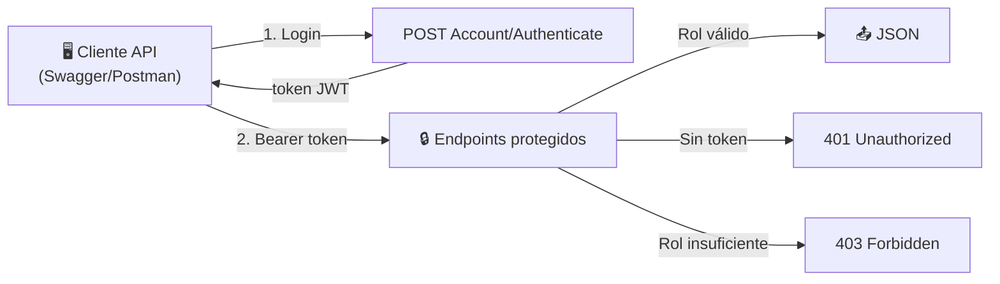

# 🔌 Web API REST

> **Desarrollador responsable:** 👑 [**Joel Benítez** (`@JoelAlBenitez`)](https://github.com/JoelAlBenitez) — Líder técnico
>
> API REST protegida con **JWT**, versionada y documentada con **Swagger**. Diseñada para roles **Administrador** y **Desarrollador**.
>
> 📎 Volver al [README principal](../README.md) · Ver [Seguridad](09-seguridad.md) · Ver [Instalación](02-instalacion-y-ejecucion.md)

---

## 📑 Índice

- [Visión general](#-visión-general)
- [🔐 Autenticación JWT](#-autenticación-jwt)
- [🎮 Controladores y endpoints](#-controladores-y-endpoints)
- [📊 Códigos de respuesta](#-códigos-de-respuesta)
- [🧾 Ejemplos de uso](#-ejemplos-de-uso)
- [Problemas resueltos y decisiones](#-problemas-resueltos-y-decisiones)

---

## 🌐 Visión general

La API es un **proyecto de presentación independiente** que reutiliza el mismo Core y la misma infraestructura que la WebApp. Características:

- 🔢 **Versionado** (`api/v{version}`) vía `Asp.Versioning`.
- 🔐 **JWT Bearer** para todos los endpoints protegidos.
- 📖 **Swagger** con botón *Authorize* para probar endpoints con token.
- 📤 Respuestas **JSON** con `JsonStringEnumConverter` (enums legibles).
- ❤️ Endpoint de salud `GET /health`.
- 🧾 **DTOs específicos** que no exponen datos sensibles (`DTOs/Api/...`).



Todos los controladores heredan de `BaseApiController`:

```csharp
[Route("api/v{version:apiVersion}/[controller]")]
[ApiController]
public abstract class BaseApiController : ControllerBase { }
```

---

## 🔐 Autenticación JWT

| Aspecto | Detalle |
|---------|---------|
| Roles API | **Administrador** y **Desarrollador** |
| Endpoint público | `Account/Authenticate` (Login) |
| Esquema | `Authorization: Bearer {token}` |
| Configuración | `JwtSettings` (SecretKey, Issuer, Audience, DurationInMinutes) |
| Bloqueo | Cliente/Agente que intenten autenticarse → **403 Forbidden** |
| Usuario inactivo | **401 Unauthorized** |

La respuesta de login incluye: **token**, **usuario**, **roles** y **expiración**.

---

## 🎮 Controladores y endpoints

### 🔑 AccountController

| Endpoint | Método | Seguridad |
|----------|--------|-----------|
| `Authenticate` | POST | 🌐 Público |
| Registrar desarrollador | POST | 🛡️ Solo Administrador |
| Registrar administrador | POST | 🛡️ Solo Administrador |

### 🏠 PropertyController — `[Authorize(Roles = "Administrador,Desarrollador")]`

| Endpoint | Método | OK | KO |
|----------|--------|-----|-----|
| `List` | GET | 200 (lista) | 204 sin datos · 500 |
| `GetById/{id}` | GET | 200 | 400 id inválido · 404 · 500 |
| `GetByCode/{code}` | GET | 200 | 400 (regex 6 dígitos) · 404 · 500 |

> El código se valida con `Regex ^\d{6}$` antes de consultar.

### 🧑‍💼 AgentController

| Endpoint | Método | Roles | Notas |
|----------|--------|-------|-------|
| `List` | GET | Admin, Dev | 204 si no hay |
| `GetById/{id}` | GET | Admin, Dev | Valida rol Agente · 404 |
| `GetAgentProperty/{id}` | GET | Admin, Dev | 204 si el agente no tiene propiedades |
| `ChangeStatus` | **PATCH** | 🛡️ **Solo Admin** | Body booleano (true=Activo) |

### 🗂️ Catálogos: PropertyTypeController · SaleTypeController · ImprovementController

Los tres exponen el mismo conjunto CRUD:

| Endpoint | Método | Roles |
|----------|--------|-------|
| `Create` | POST | 🛡️ Solo Administrador |
| `Update` | PUT | 🛡️ Solo Administrador |
| `List` | GET | Admin, Dev |
| `GetById/{id}` | GET | Admin, Dev |
| `Delete` | DELETE | 🛡️ Solo Administrador |

> El `Delete` de tipos aplica el mismo borrado en cascada que la WebApp; el `Delete` de mejora **solo** remueve relaciones.

---

## 📊 Códigos de respuesta

| Código | Significado |
|-------:|-------------|
| `200 OK` | Solicitud procesada correctamente |
| `201 Created` | Recurso creado |
| `204 No Content` | Sin datos / actualización sin cuerpo |
| `400 Bad Request` | Datos/parámetros inválidos |
| `401 Unauthorized` | Sin token o token inválido |
| `403 Forbidden` | Autenticado sin permisos suficientes |
| `404 Not Found` | Recurso inexistente |
| `500 Internal Server Error` | Error interno |

Cada controlador envuelve su lógica en `try/catch` y traduce los códigos de error del `ValidationResult` (ej. `"Property.NotFound"` → 404).

---

## 🧾 Ejemplos de uso

**1. Autenticarse**
```http
POST /api/v1/Account/Authenticate
Content-Type: application/json

{ "userNameOrEmail": "admin", "password": "•••••" }
```
```json
{ "token": "eyJhbGci...", "userName": "admin", "roles": ["Administrador"], "expiration": "2026-07-21T12:00:00Z" }
```

**2. Listar propiedades**
```http
GET /api/v1/Property/List
Authorization: Bearer eyJhbGci...
```

**3. Cambiar estado de un agente (solo Admin)**
```http
PATCH /api/v1/Agent/ChangeStatus/{agentId}
Authorization: Bearer eyJhbGci...
Content-Type: application/json

true
```

---

## 🧩 Problemas resueltos y decisiones

| Problema a resolver | Decisión de Joel |
|---------------------|------------------|
| No exponer datos sensibles | DTOs de API dedicados sin hashes ni datos internos del agente |
| Evolución sin romper clientes | Versionado `api/v1` desde el inicio |
| Distinguir "sin datos" de "no existe" | `204 No Content` en List vs. `404` en GetById |
| Probar endpoints protegidos | Swagger con esquema Bearer configurado |
| Consistencia con la WebApp | Reutiliza los mismos servicios de negocio y borrado en cascada |
| Bloquear Cliente/Agente en la API | `403 Forbidden` al intentar autenticarse con esos roles |

> 🏆 En las evaluaciones de calidad, el módulo de API alcanzó una puntuación sobresaliente por su cumplimiento de códigos HTTP, seguridad JWT (401/403), seeds activos y documentación Swagger con Bearer.

---

📎 Continúa en: [Seguridad](09-seguridad.md) · [Instalación y Ejecución](02-instalacion-y-ejecucion.md)
