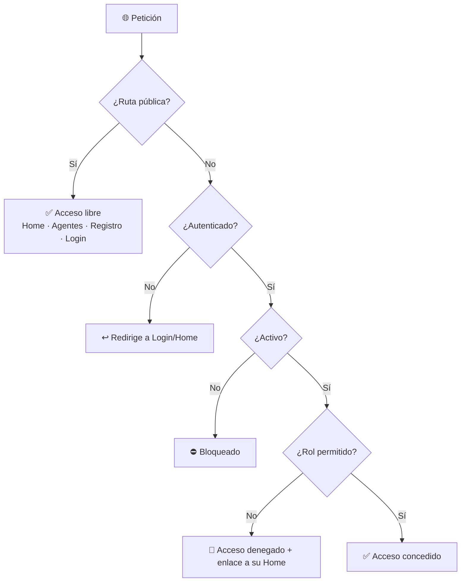
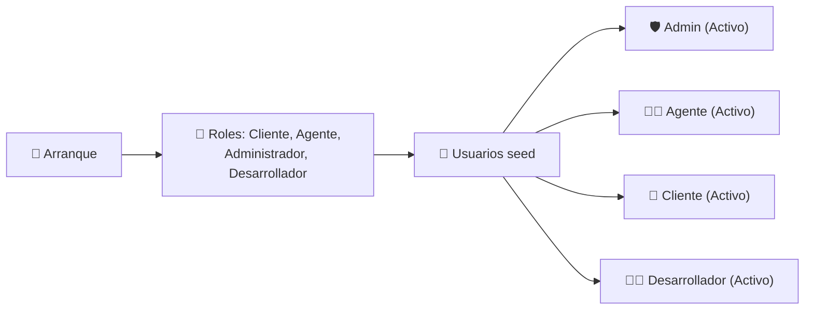

# 🔐 Seguridad y Control de Acceso

> **Desarrollador responsable:** 👑 [**Joel Benítez** (`@JoelAlBenitez`)](https://github.com/JoelAlBenitez) — Líder técnico (proyecto Identity y manejo de usuarios)
>
> Autenticación y autorización con **ASP.NET Identity** (WebApp) y **JWT** (API), control de acceso por rol y seeds.
>
> 📎 Volver al [README principal](../README.md) · Ver [API REST](08-api-rest.md) · Ver [Funcionalidades Generales](04-funcionalidades-generales.md)

---

## 📑 Índice

- [Modelo de seguridad](#-modelo-de-seguridad)
- [🔑 Autenticación](#-autenticación)
- [🛡️ Autorización por rol](#️-autorización-por-rol)
- [🚧 Control de acceso y redirecciones](#-control-de-acceso-y-redirecciones)
- [🌱 Seeds de roles y usuarios](#-seeds-de-roles-y-usuarios)
- [🔒 Buenas prácticas aplicadas](#-buenas-prácticas-aplicadas)

---

## 🧭 Modelo de seguridad

El sistema separa **funcionalidades públicas** (sin login) de **privadas** (por rol), en dos frontends con mecanismos distintos:

| Frontend | Mecanismo | Almacenamiento |
|----------|-----------|----------------|
| 🖥️ WebApp | ASP.NET Identity + **Cookies** | Sesión (`IUserSession`) |
| 🔌 API | ASP.NET Identity + **JWT** | Token Bearer |

---

## 🔑 Autenticación

- **WebApp:** login con correo **o** username + contraseña, validando estado `Activo` y rol. Cookies seguras (`HttpOnly`, `SecurePolicy.Always`, `SameSite.Lax`, expiración 30 min).
- **API:** login público que retorna JWT con **token, usuario, roles y expiración**. Firma con `JwtSettings.SecretKey`.
- **Estado:** un usuario **inactivo nunca** puede iniciar sesión ni autenticarse.

---

## 🛡️ Autorización por rol

| Rol | WebApp | API | Acceso |
|-----|--------|-----|--------|
| 👤 **Cliente** | ✅ | ⛔ 403 | Funcionalidades de cliente |
| 🧑‍💼 **Agente** | ✅ | ⛔ 403 | Funcionalidades de agente |
| 🛡️ **Administrador** | ✅ | ✅ | Todo lo administrativo + API |
| 🧑‍💻 **Desarrollador** | ⛔ | ✅ | Solo endpoints autorizados de la API |

**Reglas cruzadas:**
- Cliente ⛔ funcionalidades de agente/admin.
- Agente ⛔ funcionalidades de cliente/admin.
- Admin ⛔ funcionalidades privadas de cliente/agente.
- Desarrollador ⛔ WebApp privada.

Se implementa con filtros `[Authorize(Roles = "...")]` tanto en controladores MVC como en la API.

---

## 🚧 Control de acceso y redirecciones

- 🔒 **Acceso directo por URL** a rutas privadas está protegido (no solo la navegación visual).
- 🚫 Usuario autenticado sin permisos → pantalla **Acceso denegado** con enlace a **su** Home.
- ↩️ Usuario no autenticado → redirige a Login/Home público.
- 🧯 Errores por código HTTP → `Home/StatusCodeError` (configurado con `UseStatusCodePagesWithReExecute`).

Mensajes tipo: *"No tiene permisos para acceder a esta sección."* / *"Debe iniciar sesión para acceder a esta funcionalidad."*

---

## 🌱 Seeds de roles y usuarios

Al arrancar cualquiera de los dos frontends se ejecuta `GenerateDataSeedUsers()`, que crea **roles** y **usuarios por defecto** activos:

| Clase Seed | Crea |
|------------|------|
| `DefaultRolesSystem` | Los 4 roles del sistema |
| `DefaultUserAdmin` | Administrador por defecto |
| `DefaultUserAgent` | Agente por defecto |
| `DefaultUserCustomer` | Cliente por defecto |
| `DefaultUserDeveloper` | Desarrollador por defecto |

---

## 🔒 Buenas prácticas aplicadas

- ✅ Identity aislado en su propio proyecto con su propio `DbContext`.
- ✅ `JwtSettings` y `EmailSettings` como `sealed` con propiedades `required` → la app **no arranca** sin configuración válida (fail-fast).
- ✅ Secretos fuera del código (User Secrets / configuración).
- ✅ Cookies endurecidas (`HttpOnly`, HTTPS-only, SameSite).
- ✅ La API **no expone** contraseñas, hashes ni datos sensibles en las respuestas.
- ✅ Validación de estado `Activo` en cada punto de acceso, no solo en el login.
- ✅ Autorización aplicada en **navegación y acceso directo por URL**.

---

📎 Continúa en: [API REST](08-api-rest.md) · [Equipo y Decisiones](10-equipo-y-decisiones.md) · [Arquitectura](01-arquitectura.md)
