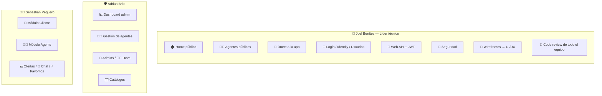

# 👥 Equipo y Decisiones de Diseño

> Reparto de responsabilidades, decisiones de cada desarrollador y convenciones comunes del proyecto **RealEstateApp**.
>
> 📎 Volver al [README principal](../README.md)

---

## 📑 Índice

- [El equipo](#-el-equipo)
- [Matriz de responsabilidades](#-matriz-de-responsabilidades)
- [Decisiones por desarrollador](#-decisiones-por-desarrollador)
- [Convenciones comunes del proyecto](#-convenciones-comunes-del-proyecto)
- [Aseguramiento de calidad](#-aseguramiento-de-calidad)

---

## 🧑‍🤝‍🧑 El equipo

| | Desarrollador | GitHub | Rol |
|---|---------------|--------|-----|
| 👑 | **Joel Benítez** | [@JoelAlBenitez](https://github.com/JoelAlBenitez) | **Líder técnico** · Code review · Reglas de negocio · Wireframes/UI-UX · API · Identity · Usuarios · Portal público |
| 🛡️ | **Adrián Brito** | [@Adrixn23](https://github.com/Adrixn23) | Módulo Administrador · Mantenimientos · Catálogos |
| 🧑‍💼 | **Sebastián Peguero** | [@SebasPeguero](https://github.com/SebasPeguero) | Módulo Agente · Módulo Cliente |

---

## 🧭 Matriz de responsabilidades

| Área del sistema | Responsable | Documento |
|------------------|-------------|-----------|
| Portal público (Home, Agentes, Registro, Login) | 👑 Joel | [04](04-funcionalidades-generales.md) |
| Web API REST | 👑 Joel | [08](08-api-rest.md) |
| Seguridad e Identity | 👑 Joel | [09](09-seguridad.md) |
| Módulo Cliente | 🧑‍💼 Sebastián | [05](05-modulo-cliente.md) |
| Módulo Agente | 🧑‍💼 Sebastián | [06](06-modulo-agente.md) |
| Módulo Administrador | 🛡️ Adrián | [07](07-modulo-administrador.md) |

---

## 🧠 Decisiones por desarrollador

### 👑 Joel Benítez (Líder técnico)

- **Un solo Core para dos frontends** — la WebApp y la API comparten servicios de negocio; las reglas se escriben una vez.
- **Wireframes primero** → UI/UX consistente con parciales reutilizables (`_PropertyCard`, `_CustomerPropertyFilter`) y CSS modular por sección.
- **Identity aislado** en su propio proyecto con su propio `DbContext`.
- **API versionada + JWT + Swagger** con DTOs que no exponen datos sensibles.
- **Fail-fast en configuración** (`JwtSettings`/`EmailSettings` `required`).
- **Code review** de todos los PRs del equipo para cumplimiento estricto de reglas de negocio.

### 🛡️ Adrián Brito (Administrador)

- **Borrado en cascada consistente** (`PropertyCascadeService`) para no dejar registros huérfanos.
- **Semántica de borrado diferenciada**: tipos borran propiedades en cascada; mejora solo quita relaciones.
- **Reglas de seguridad de administradores**: no auto-editarse/inactivarse, garantizar ≥1 admin activo.
- **Catálogos homogéneos**: tres mantenimientos con idéntica estructura y validaciones.

### 🧑‍💼 Sebastián Peguero (Agente/Cliente)

- **Aceptación de oferta atómica**: aceptar → rechazar el resto → marcar vendida, en una operación.
- **Aislamiento por usuario**: cada consulta/acción filtra por `AgentId`/`CustomerId` en sesión.
- **Anti-spam de ofertas** y **favoritas siempre disponibles** mediante servicios de validación dedicados.
- **Código único de propiedad** de 6 dígitos con verificación de unicidad.

---

## 📐 Convenciones comunes del proyecto

Acordadas por el equipo y verificadas en code review:

| Convención | Detalle |
|-----------|---------|
| 🧅 **Onion Architecture** | Dependencias hacia adentro; Dominio sin dependencias externas |
| 🎯 **`ValidationResult<T>`** | Flujo de negocio sin excepciones; errores con código |
| ✔️ **Validación separada de ejecución** | `*ValidationService` decide, `*Service` ejecuta |
| 🗃️ **Repositorios genéricos + específicos** | `IGenericRepository<TEntity,TKey>` + repos por entidad |
| 🖼️ **ViewModels con DataAnnotations** | Todas las validaciones de la WebApp en ViewModels |
| 📤 **DTOs para la API** | Contratos dedicados sin datos sensibles |
| 🔁 **AutoMapper por perfiles** | `Entity ↔ DTO ↔ ViewModel` |
| 🧩 **Composition Root único** | Todo el DI centralizado en `RealStateApp.IOC` |
| 💵 **Precios en DOP** | Pesos dominicanos en todo el sistema |
| 🎚️ **Filtros consistentes** | Toda pantalla que lista propiedades usa los mismos filtros del Home |

---

## ✅ Aseguramiento de calidad

- 👀 **Code review** obligatorio liderado por Joel antes de integrar cada módulo.
- 📋 El proyecto se evaluó contra rúbricas formales (WebApp: 1600 pts · WebApi: 605 pts) que verifican cada requerimiento funcional y técnico.
- 🧹 Foco especial en **borrado en cascada**, **consistencia de estados** (propiedad/oferta) y **cumplimiento de códigos HTTP** en la API.
- 🧭 Cumplimiento estricto de las reglas de negocio del [Documento Funcional](Mini%20proyecto%20final%20-%20RealEstateApp.pdf).

---

📎 Volver al [README principal](../README.md) · Ver [Arquitectura](01-arquitectura.md)
